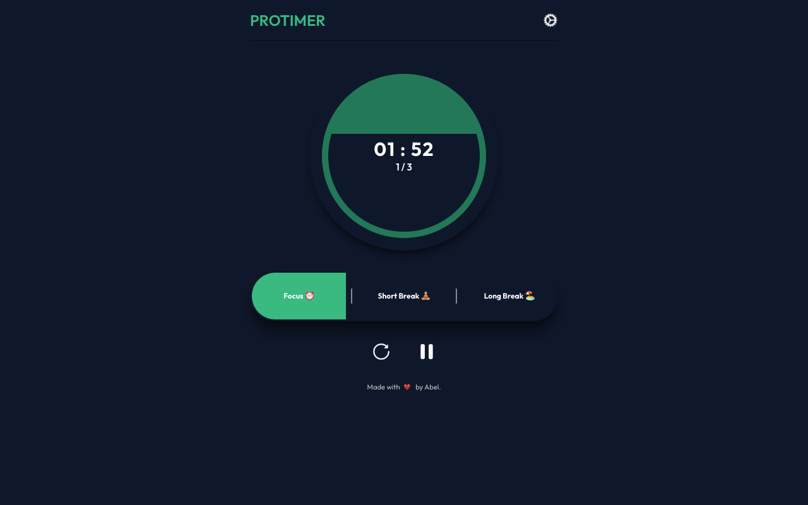

# Pomodoro Timer ⏰
[](https://app.netlify.com/sites/simplepomodoro123/deploys)

A simple Pomodoro timer to help boost productivity. The timer will alternate between the focus, short break, and long break sessions until all sessions are completed. Currently working on adding PWA features and improving some UX features.

---


---

### Built with
- Vue.js
- Javascript
- Tailwind CSS
- HTML

### Recommended IDE Setup
[VSCode](https://code.visualstudio.com/) + [Volar](https://marketplace.visualstudio.com/items?itemName=johnsoncodehk.volar)

### Configuration
- vite for build tool and vitest for tests
- See [Vite Configuration Reference](https://vitejs.dev/config/).

#### Project Setup

```sh
npm install
```

#### Compile and Hot-Reload for Development

```sh
npm run dev
```

#### Compile and Minify for Production

```sh
npm run build
```
